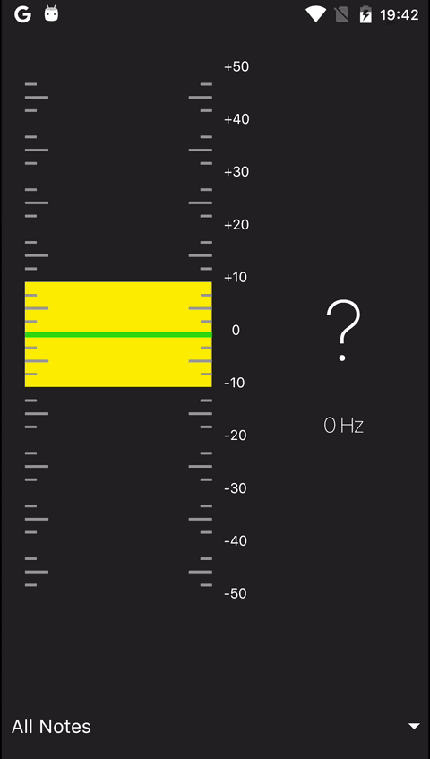

## Flageolet
 

A guitar tuner for Android. Frequency detection based on [this library YIN algorithm.](https://github.com/JorenSix/TarsosDSP) More about [YIN.](http://audition.ens.fr/adc/pdf/2002_JASA_YIN.pdf).

Work modes:

* Chromatic (C2 - B5)
* Standard Tuning (EBGDAE)
* Half Step Down (E♭B♭G♭D♭A♭E♭)
* Full Step Down (DAFDGC)
* 1.5 Steps Down (D♭A♭EBG♭D♭)
* Two Steps Down (CGE♭B♭FC)
* Drop D (EBGDAD)
* Drop C#/B♭ (D#A#F#C#G#C#)
* Drop C (DAFCGC)

